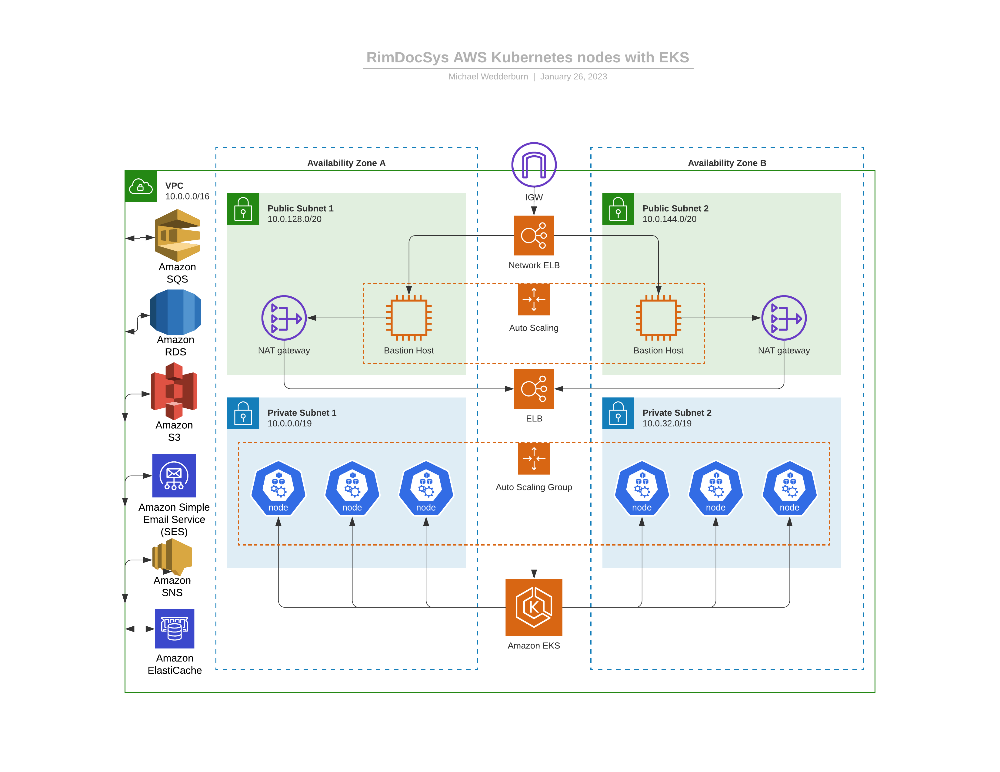

[Home](../readme.md) > [Design](design.md) > AWS

### Design (What this may look like)

---

#### AWS Diagram

##### This illustrates an infrastructure using AWS
- Bastion hosts are used to connect to the VPC and cluster
- ELB is used in case one Bastion host goes down
- Dual availability zones are used for availability
- Additional services are available inside the VPC (SQS, S3, RDS, SES and SNS)

