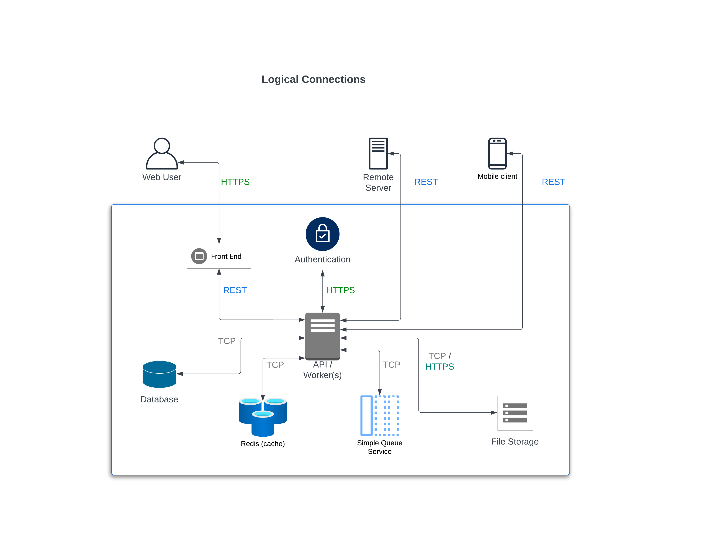
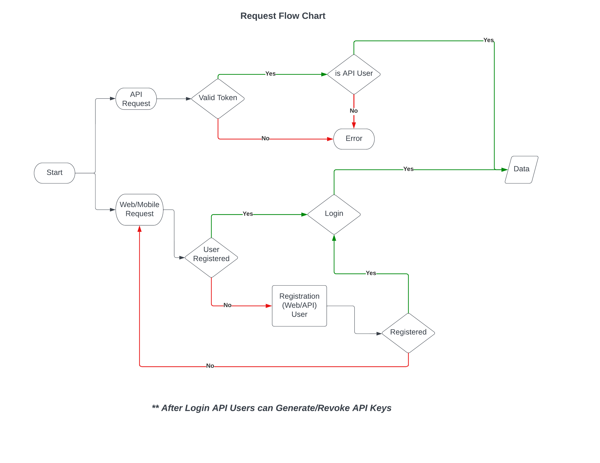

[Home](../readme.md) > Design

### Design (What this may look like)

---

#### Logical Diagram

- Users interact with our API server(s) to get authenticated
- API server(s) responds back to User with authentication information or requested data
- API server(s) is the hub of all communication in our network

#### Request Flowchart

#### Database Diagram

#### How are Document Uploads handled?

#### Web/Mobile Users
- Once a User is authenticated they are able to upload Documents
    - Web and Mobile User's file uploads are chunked in 5mb increments
    - Files are uploaded asynchronously to the server where they are then combined once upload completes
    - A marker is set locally to specify which file (part) is being uploaded. If an error occurs upload can be restarted

#### API Users

- API file uploads can be done in a number of ways
  - Payload can be sent with location of the file to be downloaded
  - Database entry is made and the response with the id and file name
  - A queue can be set up batch any such download
  - The actual download of the file is handed off to a microservice whose job is to 
    - a. Listen to the queue for events
    - b. Download the file
    - c. Move the file to its final location
    - d. Update the database with the relevant information about the file
    - e. Notify (email, webhook, pusher) that the file has been uploaded

- Files can be sent directly to the server
  - Files are sent via POST request to the API endpoint which then receives and stores the file

#### Integration with client DocSys

client decide url and mapping
we have a defined schema for our response
client decide which field is mapped to what for their response
defined API schema objects - User, Task, Document, Download
webhook/ queued up request into client systems
specify authentication, token base but can be extended to 3rd party authentication
results of request updated on dashboard with status to retry if failed
return response or specify a 200 is good enough or have user specify the exact return code or message
(same way servers do health checks)
Message queue service ie AWSSQS, Azure Service Bus, RabbitMQ ActiveMQ, Kafka,etc

[Back](../readme.md)

