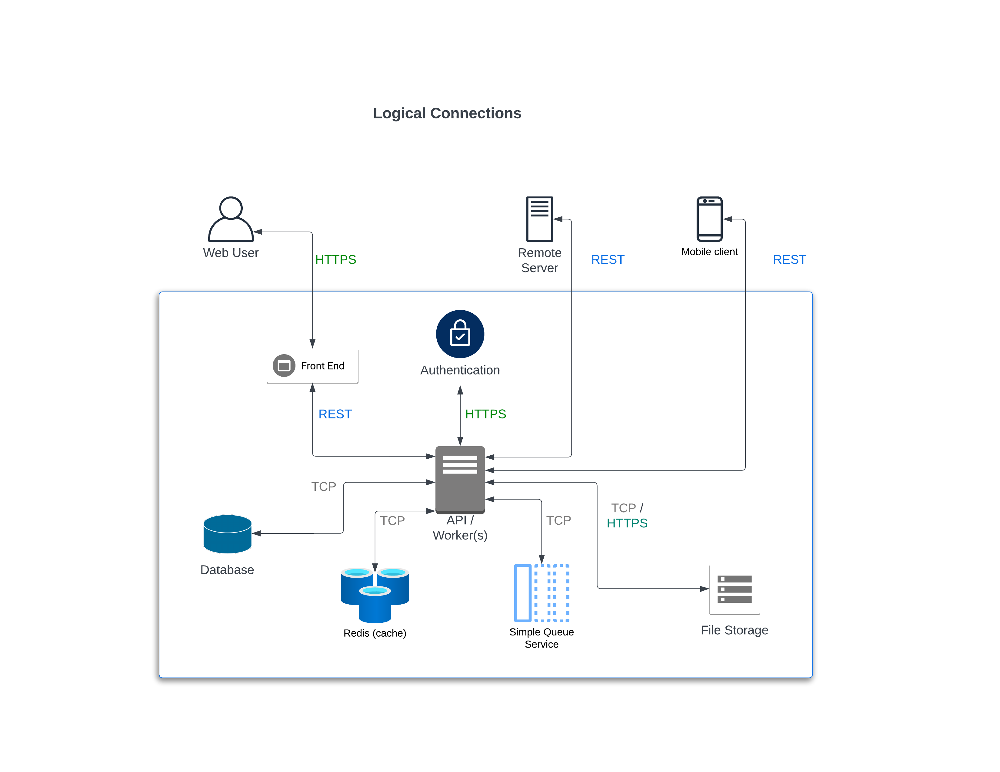

[Home](../readme.md) > [Design](design.md) > Logical

### Design (What this may look like)

---

#### Logical Diagram

##### This illustrates the base system which can be implemented regardless of environment or infrastructure
- Users interact with our API server(s) to get authenticated
- API server(s) responds back to User with authentication information or requested data
- API server(s) is the hub of all communication in our network

