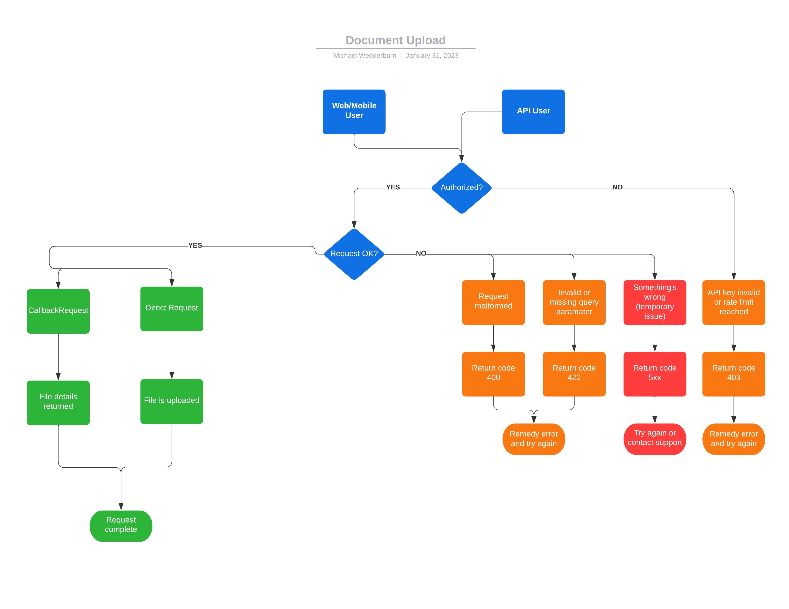

[Home](../readme.md) > [Design](design.md) > Uploads

### Document Uploads

---

#### Upload Diagram

- Users interact with our API server(s) to get authenticated
- API server(s) responds back to User with authentication information or requested data
- API server(s) is the hub of all communication in our network

